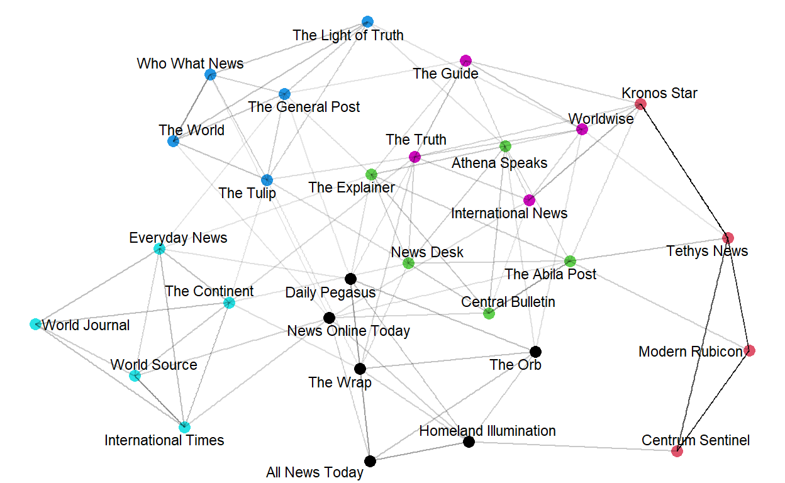

# Introduction 
The fictitious Kronos Incident saw the disappearance of several employees from the Tethys-based GASTech in January 2014 after a successful initial public offering (IPO) of the company, as well as multiple events that happened on a single day, 23 January 2014. Given that GASTech has not been very environmentally friendly in its operations of a natural gas production site in the island country of Kronos, it was suspected that a Kronos-based organization (POK) is involved in the disappearance of the employees, as a form of retaliation. In order to have a better idea on what exactly transpired to lead to the vanishing of the GASTech employees, we will be applying visual analytic techniques on the datasets provided.

This study will be handling visualizations on newspaper articles, employee records and emails, call center reports and microblog tweets in an interactive web application. Users can explore the application and understand more about GASTech’s reputation and how events unfolded on the day of the incident.

# Motivation and Objectives
The motivation behind this study is to explore and learn how visual analytics can be used for investigating crimes. With so much data being available for the kidnappings incident, it takes much time to manually look through and identify clues and patterns. Instead, we propose the usage an application where a user can interact with and better understand the relationships among people and organizations of importance, as well as see how multiple events of high consequences unfolded in the city of Abila, Kronos on the incident day.

This interactive Shiny application aims to provide information on:

1. Media portrayal of GASTech over the years
2. Relationships among GASTech, POK, the APA and Government
3. Meaningful event reports during the incident day
4. Risks identified during the incident day and their corresponding locations

# Review & Critics of Past Works
This study is based on the VAST Challenge 2021, which in turn is adapted from a similar VAST Challenge in 2014 (IEEE 2021). Literature review is conducted on the previous VAST Challenge 2014 submissions to look at the analytical techniques used to solve the challenge back then, even though the exact questions were slightly different. While useful, some of the techniques adopted have certain areas that can be further improved. 

## Text Visualisations
A study conducted by Peking University (Wang, C. et al. 2014) on Mini Challenge 1 presented their text analysis in a form of a timeline to showcase different events occurring between January 20 – 21. Articles in the form of text boxes were layered over the timeline for comparison. While it showcased all the news reporting of different events occurring over the two-day time period, it might be difficult for a user to interpret the main concepts of those articles. Hence, a better alternative might be to utilise a word cloud function to pull out key words of the articles for view and interpretation. In addition, interactive comparisons of different newsgroups can also be performed, giving the user flexibility to choose the newsgroups they are interested in to view and evaluate.

While word clouds are generally useful in identifying topic content for a broad overview as shown in the study performed by Tianjing University (Yang S. and Jiang, X. 2014) on Mini Challenge 3, their results might be less consistent and harder to make sense of due to the presence of spam data. Hence, to be able to distinguish important events from typical chatter, TF-IDF would be a better statistical tool to use. 

## Network Graphs

Network graphs are a good visualisation tool to establish the relationships between different parties of interest. By and large, network graphs would be densely populated with nodes and edges if there are numerous parties involved. Yet, this brings about an issue of overcrowding and overlaps of texts, making the entire visualisation looks cluttered (Wang, C. et al. 2014).

One way to overcome this issue of cluttering will be to divide the network graph into sub graphs. When the graph is divided, the density of the visualization will be reduced, with the readability enhanced. 

## Geospatial maps
Static geospatial maps tends to show many different points of interests, which might overload the user with content. Hence, to enhance the use of geospatial maps, we intend to include in the interactivity function so as to allow users to click and explore different points as desired. 

# Design Framework
This application makes use of the open-source R language to conduct visual analysis. The application design considerations are as follows:

* Utilize standard R packages to create reproducible text and visual analysis 

* Utilize the embedded Shiny Web Application in R to translate the codes into a webpage for users' ease of understanding  

* Provides interactivity functions for users to navigate through the app to discover trends and insights 

The design of the application will consists of five major tabs for navigation at the top panel.

i) Introduction - Describes the main purpose of our application
ii) History of GASTech - Sub tabs of Text Analysis and Network Graph to respectively discover insights from the newspaper articles and employee relationships
iii) Message Stream Exploration -  Explores tweets from different users on the incident day itself to sieve out notable keywords from otherwise spam information
iv) Risk Level Timeline tab - Further split into Call Centre Reports and Microblog Messages to detect how the public risk levels changed over time on the incident day
v) Message Stream Geomap - Shows locations where those key messages appeared 

Coupled with the interactivity aspect to choose different options from dropdown boxes to sliders for exploration, the combination of these views gives the user the flexibility and autonomy to navigate through the app to find out more information regarding the Kronos Incident.

To facilitate users in their exploration around the application, we have also provided a [user guide](https://grp15-vast-project.netlify.app/userguide) for their reference. 

## Data Preparation
The data for designing the interactive application is obtained from the [VAST Challenge 2021](https://vast-challenge.github.io/2021/index.html). It consists historical news reports, data on GAStech employees and email headers from two weeks of internal GAStech company email,call center reports and microblog tweets. These datasets are then loaded into R and processed to tidy the data.

Detailed steps on preparation of the data can be found at [Data Preparation-Part 1](https://vast-challenge.netlify.app/data_preparation.html) and 
[Data Preparation- Part2](https://isss608-kytan-vast2021.netlify.app/posts/2021-07-07-mc3/#preparation)

*Table 1 List of datasets used*

## Analytic Techniques used in Shiny App
A variety of standard R packages were used to conduct text and visual analysis on the datasets to draw useful insights. The following techniques are used for analysis.

### Text Analysis
Our application will build several text analysis outputs to break down large chunks of text data from newspaper articles and tweets into understandable visualization for users to view: 

**Comparison Cloud**

Comparison clouds are used to visualize the similarity and differences of important words used by different newsgroups. A comparison cloud was preferred over wordcloud because wordcloud tend to extract out keyword metadata and the frequency of the appearance of a particular word in only one newsgroup and it is not possible to compare various newsgroups (Halvey M.J. and Keane, M.T. 2007). Visualization of comparison clouds is useful in the quick pickup of prominent terms to determine the significance of those words. In turn, based on the keywords extracted out, we are also able to get a sense of the sentiments and attitude of these newsgroups regarding their articles about GASTech. Our application will have the option for choosing between viewing keywords from "Content of Articles" or "Titles of Articles". Moreover, users can choose the newsgroups they would have to like to compare from a dropdown list of all the newsgroups available. 

The packages used to build this visualization are **tidytext**, **tm** and **wordcloud**. **Tidytext** is used to convert text into a format that is visualisable with the use of 'unnext_tokens' function. **tm** has built in functions such as 'removeStopwords' to help in the removal of unimportant words. Lastly, the comparison cloud will be developed using the **wordcloud** package. 

**Textnet and Text Plot**

Textnet can be used to help in structuring text data, by showcasing relationships between neighbouring text data of relevance (Trigg, R.H. and Weiser, M. 1986). Hence, textnet can be used for clustering of newsgroups. To represent the data in cluster format, the data has to be converted to two columns. The first column would be the set of words found in news articles and the second is the name of newsgroups themselves. That way, a network can be created where newsgroups are connected by their use of the same words. The thickness of the edge connecting any two nodes represents how similar the two nodes are.

*Fig, 1 Relationship between different Newsgroups*

The color of the node corresponds to the text communities, with the same color indicating a strong relationship between its components. In this way, clusters are formed to segment the newsgroups with similar characteristics in terms of the types of words used in the news articles. 

To delve into the cluster segments of different newsgroup, we visualize each segmentation as follows:

*Fig. 2 Segmentation of Newsgroups into Cluster*

Upon visualizing the components in each cluster, text plot visualizations are conducted to pull out the word co-occurrences between word-pairs, so as to determine the context and content of each clusters. 

*Fig. 3 Text plot showing Word Co-occurences for Cluster 1*

The main R packages used are **textnet**, **ggwordcloud**, **tidytext**, **udpipe** and **textplot**. **Textnet** is currently the only R package available to implement text network techniques in R. To display the word cloud by cluster, **ggwordcloud** was utilized. **Tidytext** helps to convert text into a format that is visualisable with the use of 'unnest_tokens' function. The **udpipe** package provides language-agnostic tokenisation, tagging, lemmatisation and dependency parsing of raw text, which is an essential part in natural language processing (NLP). Lastly, to plot data as a text plot, we will be needing the **textplot** package. 

**Correlation Graphs** 

Correlation graphs are plotted to determine the correlation between different newsgroups. From this, we are able to determine how strongly or weakly the newsgroups are related to each other. The correlation values are obtained using the widely used Pearson method (Glen, S.).

The R packages used are **widyr** and **ggraph**. **Widyr** is able to cast a tidy dataset into a wide matrix, performs an operation such as computing the correlation on it, and then re-tidies the result. 'pairwise_cor' function is found in this package. **ggraph** is then used to plot the relationship between different newsgroups based on their correlation values. 

**Term Frequency-Inverse Document Frequency (TF-IDF)**

As mentioned in the **Review & Critics of Past Works** section, word cloud alone might not be very useful to visualise a collection of microblog message due to its consistency issue. As such, TF-IDF approach is more helpful when trying to pick out specific key events/topics of relevance. This approach aims to measure the importance of a word is to a document in a collection/corpus of documents, by including the inverse document frequency (IDF) to balance the term frequency (TF) used in wordclouds (Silge, J. and Robinson, D. 2021). Hence, we will view each hour of tweets as a document and all 5 hours of the dataset as the corpus, to determine the key events that dominate each hour. With that, TF-IDF can be a powerful heuristic to sieve out the most important events occurring during each period from the chatter spread throughout the dataset. Both unigrams and bigrams are plotted to look at both the singular word and word-pairs respectively. 

The relevant R package used is **tidytext**, where the 'bind_tf_idf' function helps to compute and bind the term frequency, inverse document frequency and td-idf of a tidy text dataset to the dataset. 

### Network Graphs
Network graphs are informative visualizations to mainly show the relationship between different entities. In this study, network graphs are created to visualizes the different official and unofficial relationships of GASTech employees and the overall exchange flow of emails.

**Email Flow**

The email distribution flow from one person to another is visualized in terms of a network graph. The thickness of the edge implies the number of email passed between two nodes. The nodes are grouped by the employees' "Current Employment Type", and users also have the option to view select the email distribution flow on a daily basis or on a weekly basis.

*Fig. 4 Two Week Email flow by Employment Type*

**Relationships among GASTech Employees**

The email relationships of the employees are split into work-related and non-work related, in attempt to identify potential suspicious activities that might be transpiring between different employees. There are four different views of the network graphs, with the nodes sorted by "Citizenship", "Current Employment Type", "Gender" and "Current Employment Title".

The main R packages needed to create network graphs are **tidygraph** and **ggraph**. Under **tidygraph**, the 'tbl_graph' function is used to convert data to an object to display network belongs to this package. **ggraph** is used to plot the network object. 

### Timeline Charts
Separate timeline charts are plotted using the **ggplot2** package to look into the frequency of the microblog and call center reports coming in over a fixed time period of between 1700H to 2200H. Through that, we aim to discover the risk levels indicated by these data using quantitative estimates, to draw out a basic timeline of major events that occurred during that evening. 

Data tables using the **dt** package are also linked to these chart to show the exact messages that are received tagged to both time and location.

### Geospatial Mapping
Interactive geospatial mapping visualization is performed so as to track the locations where those microblogs tweets and call center reports originate from. The interactive view mode allow layers to be removed or added, as well as show the exact messages by clicking on the points.

The R package used is **tmap** to generate thematic maps with high flexibility and interactivity.

# Application Insights
From our Shiny application, different insights can be drawn to learn more about the Kronos Incident. 

## Content of Newsgroups

*Fig. 5 Comparison Word Cloud between 6 Newsgroups by Content*

Looking into Fig. 5, we can observe that "News Online Today" is the newsgroup that mostly talked about the situation in Kronos, with a majority of articles speaking about POK but little was spoken about the contamination and health of the Kronos villagers. Hence, this implies that "News Online Today" seems to be targeting the POK group the most.

On the other hand, "The Continent" has been reporting on the calamity, evacuation and discharge, with little spoken about GASTech or POK. "Everyday News" reports more on the crashes and explosions occurring in Kronos. 

The remaining three newsgroups appear to be international news outlets and their keywords vary diversely, with none specifically mentioning about the situation in Kronos. 

## Context of Clusters 

*Fig. 6 Text plots of News Titles for Clusters 1-3*

*Fig. 7 Text plots of News Titles for Clusters 4-6*

Clustering using text net separated all of the newsgroups into six different clusters. The content across all articles within each cluster mostly talks about of the following characteristics:

* Cluster 1 - Relationship between police, government and leader of POK Elian Karel with very little involvement of GAStech company
* Cluster 2 - POK in general and mentions of GASTech employees
* Cluster 3 - Relationship between police, government and POK
* Cluster 4 - CEO of GASTech company and company's investment plans
* Cluster 5 - Nature of GASTech company as well as relationship between government and POK
* Cluster 6 - Tension between police and POK + Health situation in Kronos

## Correlation between Articles 

Looking at the highly correlated articles (with r > 0.9), we can observe that the highest pair of correlated articles are "The Light of Truth" and "The General Post". These two nodes have the thickest edge connecting between them, suggesting a high similarity between the words used by the two newsgroups. Referencing to Fig. 2 above, we can observe that these two newsgroups also fall in the same cluster - Cluster 4.  

*Fig. 8 Highly Correlated Newsgroups*

Fig. 8 also shows the highest frequency of words used in the articles published by these two newsgroups. It appears that both of these published articles mostly contain words like "Kronos", "gas", "government", "Sten" and "company". From this, we can understand that articles published by these 2 newsgroups are mainly about the GASTech company and its operations in Kronos. 

## Email Flow and Distribution

Based on the segregation between work related and non-work related emails, we are able to derive the following insights

### Work Related Emails

*Fig. 9 Network graph of Work Related Email Flow by Employment Type*

* Heavy weight assigned to Information Technology, eliminating any suspicious activity occurring in this department 
* Employees in Engineering department seem to have more communication among themselves than the other departments
* One particular IT employee who seems to be communicating with the Security and Administration department but not with their own department, which raises suspicion

### Non-work Related Emails 

*Fig. 10 Network graph of Non-work Related Email Flow by Employment Type*

* Executive Department has more non-work related emails than work-related emails 
* One IT employee seems to be the most common receiver and sender of non-work related emails 
* Heavy transmission of unofficial emails among Administration Department

## Microblog Tweets Analysis

*Fig. 11 Word-pairs with varying frequency by Hour*

From this bigram plotted, we are able to extract certain important information as follows:

* 1800H+: The fire was likely related to a building, the apartment complex of Dancing Dolphon 
* 1900H+: Shots were fired, with a trapped resident and black van being other points of interest.
* 2000H+: A firefighter was injured. A phrase “alexandrias ithakis” appears (this is the cross-street where the standoff happened). Several businesses appear to be affected as well.
* 2100H+: Besides the arrests already spotted in the wordcloud, an alarming event of explosions heard also appears.

## Risk Levels From Call Center Reports
The basic timeline of major event identified over the course of the evening with its respective risk ratings (on a scale of 1-5, 5 being highest) are as follows:

1. The first big event was a fire detected at about 1830H (exact time: 1842H). An ambulance and fire truck was dispatched to the fire. Crowd control was also requested. The risk appears to have elevated, but appeared under control (risk level 3).

2. The next big event happened from 1915H: what appeared as a vehicle accident (exact time: 1919H) turned out to be a rogue black van running amok in the crowd. It was pursued by police units. Risk level would have gone up to 4, due to the uncontrollable nature of the van.

3. From 1930H, at least one officer was down because of the event (exact time: 1941H). A dire emergency was called, and additional support was requested. Risk level would have been at 5 (given that the situation was termed “dire”).

4. Nearing the end after the black van and fire incident seemed to have died down, from 2045H there were several reports of crime scene investigations, with continued suspicious reports. Risk level would be at 3 (moderate).

## Map of Key Event Locations

*Fig. 12 Geomap showing Origin of Key Messages*

From Fig. 12, we are able observe that there are three locations with high density of message origination, suggesting that major events are occurring around those location clusters.

The red cluster appears to be the place with highest risk and potential consequences, due to the high number of negative tweets and several serious call center reports spread over time. Both types of messages mention the standoff and police casualties. 

The blue cluster also has many call center reports, but lesser negative tweets. Closer inspection by clicking on the points show that these tweets are mainly about the fire which appeared to have been under control, and the call center reports are mostly about dispatch requests. 

The brown cluster seems to be about the hit-and-run incident. Closer inspection shows that many of the messages at this location are sent by a spam account footfingers, and are unimportant.

# Conclusion and Future Work
In conclusion, this study attempts to draw out insights related to the disappearance of the GASTech employees from a collection of artifacts and emails related to the GASTech company. The analysis in our web application is scoped to investigate how events unfolded on the day of incident and prove the reputation of GASTech since its establishment. 

Further developments to the application can be implemented such that users can upload their own datasets, like text corpus into the application to conduct text and visual analysis on new datasets. 

# References

---
references:
- id: vast2021
  title: "VAST Challenge 2021"
  author: IEEE
  type: website
  publisher: IEEE
  URL: "https://vast-challenge.github.io/2021/"
  issued:
    year: 2021
- id: pekingvast2014
  title: "VAST Challenge 2014 Mini Challenge 1"
  author: 
  - family: Wang
    given: Chenglong
  - family: Cheng
    given: Siming
  - family: Miao
    given: Zhengjie
  - family: Yuan
    given: Xiaoru
  type: website
  publisher: Peking University
  URL: "https://www.cs.umd.edu/hcil/varepository/VAST%20Challenge%202014/challenges/MC1%20-%20Disappearance%20at%20GASTech/entries/Peking%20University/"
  issued:
    year: 2014
- id: tianvast2014
  title: "VAST Challenge 2014 Mini Challenge 3"
  author: 
  - family: Yang
    given: Siqi
  - family: Jiang
    given: Xinyi
  type: website
  publisher: "Tianjing University"
  URL: "https://www.cs.umd.edu/hcil/varepository/VAST%20Challenge%202014/challenges/MC3%20-%20Real-Time,%20Streaming%20Social%20Media/entries/Tianjin%20University/"
  issued:
    year: 2014
- id: halveykeane
  title: "An Assessment of Tag Presentation Techniques"
  author:
  - family: "Halvey"
    given: "Martin J."
  - family: "Keane"
    given: "Mark T."
  container-title: "WWW '07: Proceedings of the 16th international conference on World Wide Web"
  URL: "https://doi.org/10.1145/1242572.1242826"
  DOI: 10.1145/1242572.1242826
  publisher: Association for Computing Machinery
  page: 1313-1314
  type: article-journal
  issued:
    year: 2007
    month: 5
- id: triggweiser
  title: "TEXTNET: A Network-Based Approach to Text Handling"
  author:
  - family: "Trigg"
    given: "Randall H."
  - family: "Weiser"
    given: "Mark"
  container-title: "ACM Transactions on Information Systems"
  Volume: 11
  URL: "https://doi.org/10.1145/5401.5402"
  DOI: "10.1145/5401.5402"
  issue: 1
  publisher: "Association for Computing Machinery"
  page: 1-23
  type: article-journal
  issued:
    year: 1986
    month: 1
- id: glen
  title: "Correlation Coefficient: Simple Definition, Formula, Easy Steps"
  author: 
  - family: Glen
    given: Stephanie
  type: website
  URL: "https://www.statisticshowto.com/probability-and-statistics/correlation-coefficient-formula/"
  publisher: Statistics How To
- id: silge
  title: "Analysing word and document frequency: tf-idf"
  author:
  - family: Silge
    given: Julia
  - family: David
    given: Robinson
  container-title: "Text Mining with R: A Tidy Approach"
  URL: 'https://www.tidytextmining.com/tfidf.html'
  type: book
  issued:
    year: 2021
    month: 6
...

