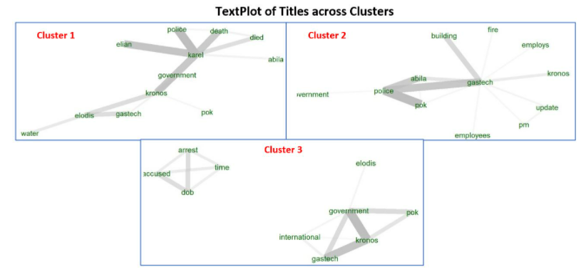
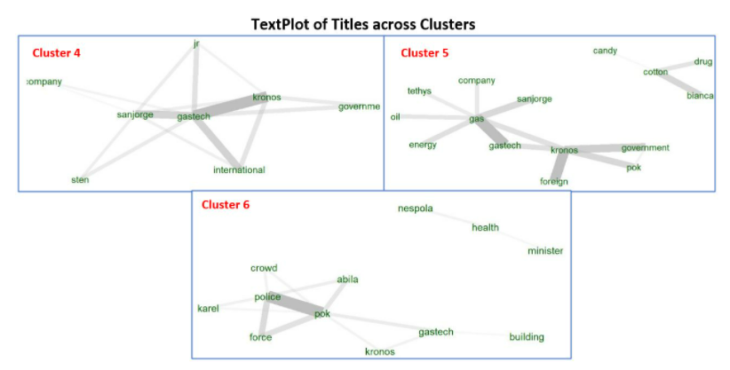
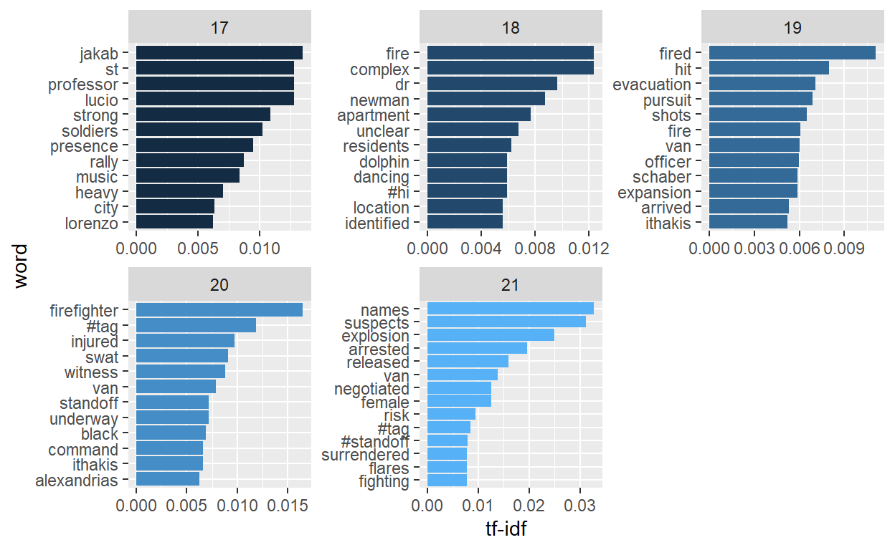

```{r setup, include=FALSE}
knitr::opts_chunk$set(echo = FALSE)
```

# Introduction / Problem Statement

The fictitious Kronos Incident saw the disappearance of several employees from the Tethys-based GASTech in January 2014, as well as multiple events that happened on a specific day 23 Jan 2014. In order to have a better idea on what exactly transpired in this period, we will be applying visual analytical techniques on the datasets through the developed Shiny App on the following [link](https://fuytio.shinyapps.io/VAST2021-T15-Shiny/).

# Motivation

There is a lot of information provided in the datasets, such as newspaper articles, employee records and emails, call center reports and microblog tweets. They are rich but difficult to sieve through. However, visual analytics can help us find useful info, such as:

1. Media portrayal of GASTech over the years
2. Relationships among GASTech, POK, the APA and Government
3. Meaningful event reports during the incident day
4. Risks identified across time and their corresponding locations

# Approach

The application consists of 5 major interactive tabs:

i) Introduction - Describes the main purpose of our application
ii) History of GASTech - Sub tabs of Text Analysis and Network Graph to discover insights from newspaper articles and employee relationships
iii) Message Stream Exploration -  Explores tweets and sieve out notable keywords from otherwise spam information
iv) Risk Level Timeline - Assess risk levels from message stream
v) Message Stream Geomap - Shows locations of key messages

**Text Analytics**

*Comparison Cloud*

Comparison clouds visualise the similarity and differences of important words used by different newsgroups. From them, we are able to get a sense of the sentiments and attitude of these newsgroups. Packages involved are `tidytext`, `tm` and `wordcloud`.

*Textnet and Text Plot*

Textnet is used for clustering of newsgroups. The thickness of the edge connecting any two nodes represents how similar the two nodes are.

{width=32%}
{width=32%}
{width=32%}

The color of the node corresponds to the text communities, with the same color indicating a strong relationship between its components. Clusters are then formed to segment the newsgroups with similar characteristics. 

Upon visualizing the components in each cluster, text plot visualizations are conducted to pull out the word co-occurrences between word-pairs, so as to determine the context and content of each clusters. 

Packages used: `textnet`, `ggwordcloud`, `udpipe`, `textplot`.

<!-- *Correlation Graphs*  --> <!-- not enough space -->
<!-- Correlation graphs are plotted to determine the correlation between different newsgroups using the Pearson method. From this, we are able to determine which newsgroups might be highly related in terms of their reports of certain events over the years. -->

<!--  -->

<!-- The R packages used are **widyr** and **ggraph**.  -->

*Term Frequency-Inverse Document Frequency (TF-IDF)*

TF-IDF (using `tidytext` package) measures the importance of a word/word-pair to a document in a collection of documents. It sieves out the most important events occurring during each period from the chatter.

**Network Graphs**

Using `tidygraph` and `ggraph`, the email distribution flow from one person to another is visualised in terms of a network graph. The thickness of the edge implies the number of email passed between two nodes.

{width=48%}
{width=48%}

The email relationships of the employees are split into work-related and non-work related, in attempt to identify potential suspicious activities that might be transpiring between different employees.

**Timeline Charts**

Separate timeline charts are plotted using the `ggplot2` and `DT` package to look into the the microblog and call center reports. Through that, we aim to discover the risk levels over the incident time. 

**Geospatial Mapping**

Interactive geospatial visualisation is performed using the `tmap` package. The interactive view mode allow layers to be removed or added, as well as show the exact messages by clicking on the points.

# Results / Key Findings

**Content of Newsgroups (using Comparison Cloud)**

{width=60%}

**Context of Clusters**

{width=48%}
{width=48%}

**Key Topics from Microblog Analysis (using bigram TF-IDF)**

{width=70%}

**Map of Key Event Locations**

{width=70%}

# Future Work

Further developments to the application can be implemented such that users can upload their own datasets, like text corpus into the application to conduct text and visual analysis on new datasets. 

# References

Placeholder
