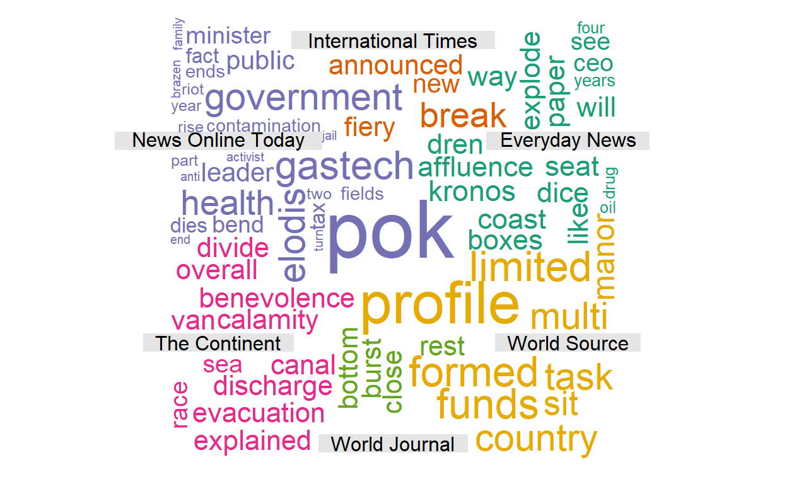
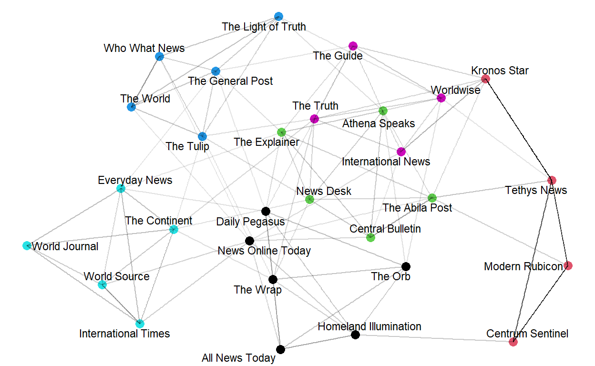
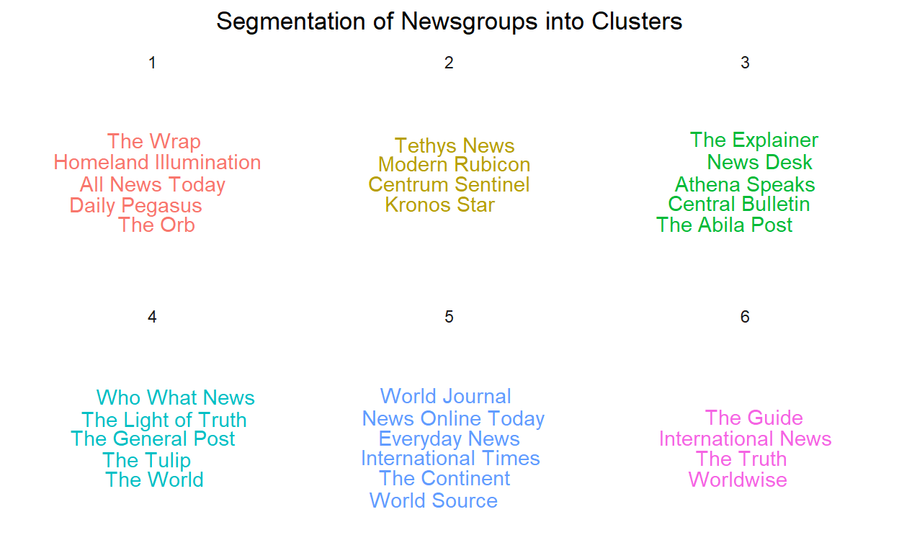
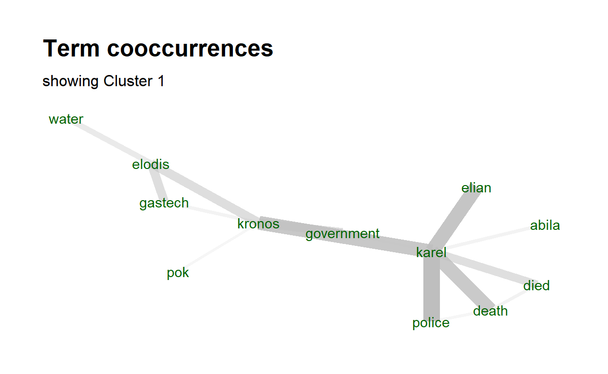

# Introduction 
The fictitious Kronos Incident saw the disappearance of several employees from the Tethys-based GASTech in January 2014 after a successful initial public offering (IPO) of the company. Given that GASTech has not been very environmentally friendly in its operations of a natural gas production site in the island country of Kronos, it was suspected that a Kronos-based organisation (POK) is involved in the disappearance of the employees, as a form of retaliation. In order to have a better idea on what exactly transpired to lead to the vanishing of the GASTech employees, we will be applying visual analytical techniques on the datasets provided.

This study will be handling visualisations on newspaper articles, employee records and emails, call center reports and microblog tweets before structuring them into an interactive web application. Users can then investigate the application and understand more about GASTech's reputation. Furthermore, one can navigate around the app to find out how certain events unfolded on the incident day itself.  

# Motivation and Objectives
The motivation behind this study is to look into analytical techniques to visualise large chunks of text data effectively using R Studio. By doing so, we are able to better understand the relationships among people and organisations of importance, as well as see how multiple events of high consequences unfolded in Abila on the incident day.

This interactive Shiny app aims to provide information on:

1. Media portrayal of GASTech over the years
2. Relationships among GASTech, POK, the APA and Government
3. Meaningful event reports during the incident day
4. Risks identified during the incident day and their corresponding locations

# Review & Critics of Past Works
This study is based on the VAST Challenge 2021, which in turn is adapted from a similar VAST Challenge in 2014. Literature review is conducted on the previous VAST Challenge 2014 submissions to look at the analytical techniques used to solve the challenge back then, even though the exact questions were slightly different. While useful, some of the techniques adopted have certain areas that can be further improved. 

## Text Visualisations
A study conducted by Peking University (2014) on Mini Challenge 1 presented their text analysis in a form of a timeline to showcase different events occurring between January 20 – 21. Articles in the form of text boxes were layered over the timeline for comparison. While it showcased all the news reporting of different events occurring over the two-day time period, it might be difficult for a user to interpret the main concepts of those articles. Hence, a better alternative might be to utilise a word cloud function to pull out key words of the articles for view and interpretation. In addition, interactive comparisons of different newsgroups can also be performed, giving the user flexibility to choose the newsgroups they are interested in to view and evaluate.

While word clouds are generally useful in identifying topic content for a broad overview as shown in the study performed by Tianjing University (2014) on Mini Challenge 3, their results might be less consistent and harder to make sense of due to the presence of spam data. Hence, to be able to distinguish important events from typical chatter, TF-IDF would be a better statistical tool to use. 

## Network Graphs
Network graphs are a good visualisation tool to establish the relationships between different parties of interest. By and large, network graphs would be densely populated with nodes and edges if there are numerous parties involved. Yet, this brings about an issue of overcrowding and overlaps of texts, making the entire visualisation looks cluttered, as seen in Fig. x.

One way to overcome this issue of cluttering will be to divide the network graph into sub graphs. When the graph is divided, the density of the visualisation will be reduced, with the readability enhanced. 

## Geospatial maps
Static geospatial maps tends to show many different points of interests, which might overload the user with content. Hence, to enhance the use of geospatial maps, we intend to include in the interactivity function so as to allow users to click and explore different points as desired. 

# Design Framework
This application makes use of the open-source R language to conduct visual analysis. The application design considerations are as follows:

* Utilise standard R packages to create reproducible text and visual analysis 
* Utilise the embedded Shiny Web Application in R to translate the codes into a webpage for users' ease of understanding  
* Provides interactivity functions for users to navigate through the app to discover trends and insights 

The design of the application will consists of five major tabs for navigation at the top panel.

i) Introduction - Describes the main purpose of our application
ii) History of GASTech - Sub tabs of Text Analysis and Network Graph to respectively discover insights from the newspaper articles and employee relationships
iii) Message Stream Exploration -  Explores tweets from different users on the incident day itself to sieve out notable keywords from otherwise spam information
iv) Risk Level Timeline tab - Further split into Call Centre Reports and Microblog Messages to detect how the public risk levels changed over time on the incident day
v) Message Stream Geomap - Shows locations where those key messages appeared 

Coupled with the interactivity aspect to choose different options from dropdown boxes to sliders for exploration, the combination of these views gives the user the flexibility and autonomy to navigate through the app to find out more information regarding the Kronos Incident.

To faciliate users in their exploration around the application, we have also provided a [user guide](https://grp15-vast-project.netlify.app/userguide) for their reference. 

## Data Used
The datasets used in this study is taken from the VAST Challenge 2021 Mini Challenges 1 and 3. They are collated in the following tables as shown below. 

#HOW TO INSERT TABLE GAHHHH#

These datasets are then loaded into R and further data preparation is conducted to clean these raw data mainly with the tidyverse package.  

## Analytic Techniques used in Shiny App
A variety of standard R packages were used to conduct text and visual analysis on the datasets to draw useful insights. The following techniques are used for analysis.

### Text Analysis
Our application will build several text analysis outputs to break down large chunks of text data from newspaper articles and tweets into understandable visualisation for users to view: 

**Comparison Cloud**

Comparison clouds are used to visualise the similarity and differences of important words used by different newsgroups. Wordclouds are able to extract out keyword metadata and the frequency of the appearance of a particular word in the articles is determined by the size of the word in the wordcloud. This type of visualisation is useful in the quick pickup of prominent terms to determine the significance of those words. In turn, based on the keywords extracted out, we are also able to get a sense of the sentiments and attitude of these newsgroups regarding their articles about GASTech. 

Fig. x above shows the comparison cloud between six newsgroups based on the words taken from the published news articles' titles. Our application will have the option for choosing between viewing keywords from "Content of Articles" or "Titles of Articles". Moreover, users can choose the newsgroups they would have to like to compare from a dropdown list of all the newsgroups available. 

The packages used to build this visualisation are **tidytext**, **tm** and **wordcloud**. **Tidytext** is used to convert text into a format that is visualisable with the use of 'unnext_tokens' function. **tm** has built in functions such as 'removeStopwords' to help in the removal of unimportant words. Lastly, the comparison cloud will be developed using the **wordcloud** package. 

**Textnet and Text Plot**

Textnet is used for clustering of newsgroups. To represent the data in cluster format, the data has to be converted to two columns. The first column would be the set of words found in news articles and the second is the name of newsgroups themselves. That way, a network can be created where newsgroups are connected by their use of the same words, as shown in Fig. X. The thickness of the edge connecting any two nodes represents how similar the two nodes are.

The node color corresponds to the text communities, with the same color indicating a strong relationship between its components. In this way, clusters are formed to segment the newsgroups with similar characteristics in terms of the types of words used in the news articles. 

To delve into the cluster segments of different newsgroup, we visualize each segmentation as follows:

Upon visualizing the components in each cluster, text plot visualizations are conducted to pull out the word co-occurrences between word-pairs, so as to determine the context and content of each clusters. 

The main R packages used are **textnet**, **ggwordcloud**, **tidytext**, **udpipe** and **textplot**. **Textnet** is currently the only R package available to implement text network techniques in R. To display the word cloud by cluster, **ggwordcloud** was utilised. **Tidytext** helps to convert text into a format that is visualisable with the use of 'unnest_tokens' function. The **udpipe** package provides language-agnostic tokenisation, tagging, lemmatisation and dependency parsing of raw text, which is an essential part in natural language processing (NLP). Lastly, to plot data as a text plot, we will be needing the **textplot** package. 

**Correlation Graphs** 
Correlation graphs are plotted to determine the correlation between different newsgroups. From this, we are able to determine which newsgroups might be highly related in terms of their reports of certain events over the years. The correlation values are obtained using the widely used Pearson method. 

The R packages used are **widyr** and **ggraph**. **Widyr** is able to cast a tidy dataset into a wide matrix, performs an operation such as computing the correlation on it, and then re-tidies the result. 'pairwise_cor' function is found in this package. **ggraph** is then used to plot the relationship between different newsgroups based on their correlation values. 

**TF-IDF**
As mentioned in the **Review & Critics of Past Works** section, word cloud alone might not be very useful to visualize a collection of 'microblog' messages due to its consistency issue. As such, TF-IDF approach is more helpful when trying to pick out specific key events/topics of relevance. 

### Network Graphs

**Relationships of GASTech Employees**

**Email Flow**

**Target Employee**

### Geospatial mapping

# Application Insights
Nullam semper imperdiet orci, at lacinia est aliquet et. Sed justo nibh, aliquet et velit at, pharetra consequat velit. Nullam nec ligula sagittis, adipiscing nisl sed, varius massa. Mauris quam ante, aliquet a nunc et, faucibus imperdiet libero. Suspendisse odio tortor, bibendum vel semper sit amet, euismod ac ante. Nunc nec dignissim turpis, ac blandit massa. Donec auctor massa ac vestibulum aliquam. Fusce auctor dictum lobortis. Vivamus tortor augue, convallis quis augue sit amet, laoreet tristique quam. Donec id volutpat orci. Suspendisse at mi vel elit accumsan porta ac ut diam. Nulla ut dapibus quam.

# Conclusion and Future Work
The study 

Further developments to the application can be implemented such that the application is able to take out other text data such as text corpus  

# References

---
references:
- id: meier2012
  title: Professinal Android 4 Application Development
  author: 
  - family: Meier
    given: Reto
  type: book
  publisher: John Wiley & Sons, Inc.
  issued:
    year: 2012
    month: 5
- id: fenner2012a
  title: One-click science marketing
  author:
  - family: Fenner
    given: Martin
  container-title: Nature Materials
  volume: 11
  URL: 'https://doi.org/10.1038/nmat3283'
  DOI: 10.1038/nmat3283
  issue: 4
  publisher: Nature Publishing Group
  page: 261-263
  type: article-journal
  issued:
    year: 2012
    month: 3
...

