```{r setup, include=FALSE}
knitr::opts_chunk$set(echo = TRUE, warning=FALSE,message=FALSE)
```


### User Guide: Viz-Investigation of Kronos Incident

### 1	Introduction Page 

On this page, there is a short description of the application and an overview of the application navigation.

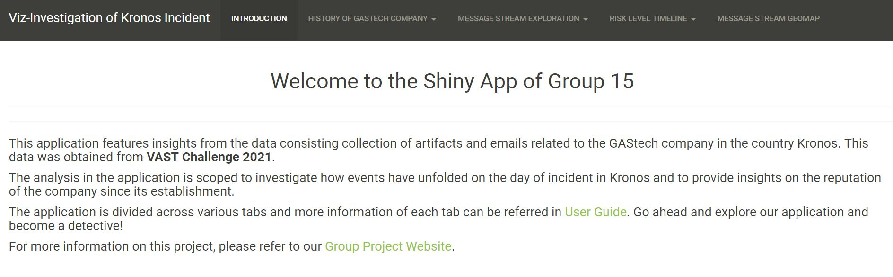

### 2 History of GAStech Company

This sub section of the application is to set the scene of the history that the GAStech company has had in Kronos. It provides information of the type of reputation and relations the company has had over the years with the citizens of Kronos and the protesters of “POK” in general.

### 2.1	Text Analysis

Insights on the news paper articles published from the start of establishment of the company in Kronons all the way to the year of the incident can be drawn from this section. It involves a lot of text data being visualized and cluster analysis.  

#### 2.1.1	Comparison Cloud of Articles

This is a comparison word cloud of newspaper articles that were published over the years that GAStech company has been established. The differences in the type of content written across various newspaper groups can be visualized.

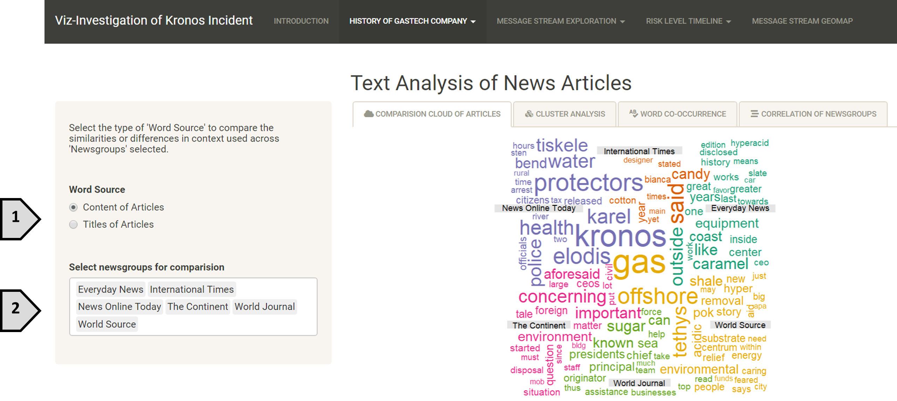
[1] Select the type of data to populate the cloud. Content represents the words within the articles and title are the titles of articles.

[2] One or more number of newspaper groups can be selected from the dropdown list of all news groups available to compare the articles of those newspapers.

#### 2.1.2   Cluster Analysis

This clustering is a “TextNet” that identifies those newsgroups that are similar based on the type of words they use. The darker the edge, the more similar those newsgroups are. All the newspaper groups that we have are segregated into 6 clusters overall. 


[1] Select the number of edges a node should have to visualize only those node names.

[2] Select the cluster group number to view the newspaper groups in that cluster more clearly.


#### 2.1.3   Word Co-occurrence

This visualization is a “Text Plot” that shows the collections of word pair and how frequent these word pairs occur represented by the thickness of the edges between these words. The thicker the edge, the more frequently those words are used together.

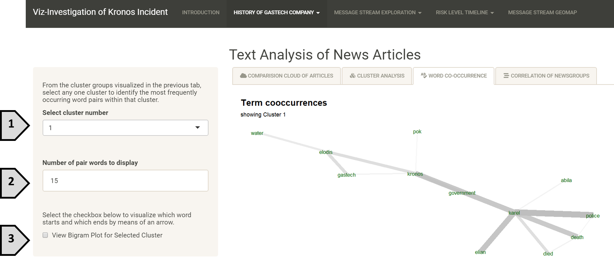
[1] Select the cluster number to view those word that are commonly used together.

[2] Enter the number of word pars to display.

[3] Select checkbox to view “Bigram plot” for a more detailed understanding of which words comes first the which word follows.

 Upon selecting the checkbox,

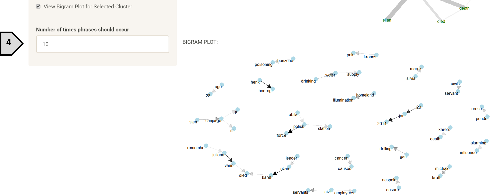

[4] Enter the number of times the phrases should occur for them to appear on the plot.

#### 2.1.4 Correlation of Newsgroups

In this tab, the correlation value of the newsgroups can be identified. Previously we have seen which newsgroups are similar and how they have been clustered but, in this tab, we can visualize the correlation value between them.


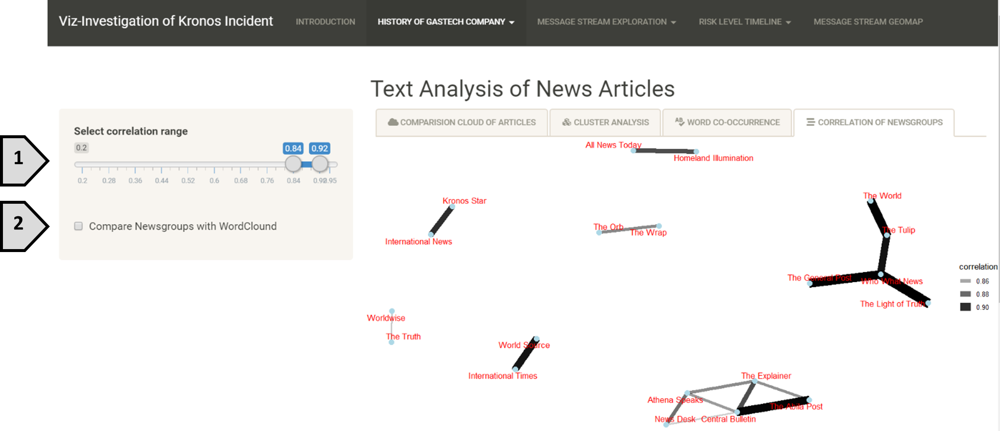
[1] Select the range of correlation value.

[2] Select the checkbox to view word clouds of two different newsgroups and compare how similar or different they are.

Upon selecting the checkbox,

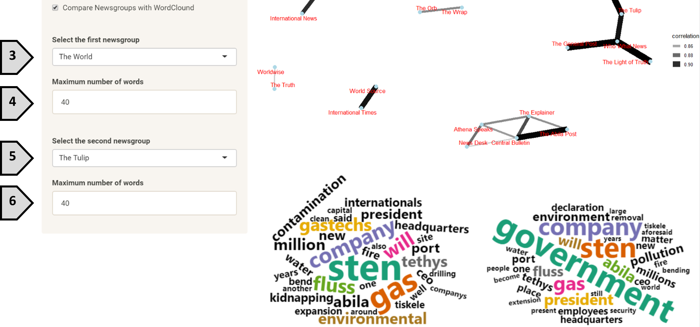

[3] Select the first newspaper group from the dropdown to visualize its word cloud.

[4] Select the number of words to be visualized in the first word cloud.

[5] Select the second newsgroup.

[6] Select the number of words to be visualized in the second word cloud.

### 2.2 Network Graph
Under this sub section, insights on employees working within the GAStech company can be extracted. It consists of both the official and unofficial emails sent across the company 2 weeks before the incident. The behavior of employees within these 2 weeks can provide vital information in this investigation.

#### 2.2.1 Relationships
This tab shows the network of work-related emails and non-work-related emails exchanged across all employees. The employees are represented by nodes and the thickness of edges represents the number of emails exchanged between the two nodes. The thicker the edge, the greater number of emails exchanged.

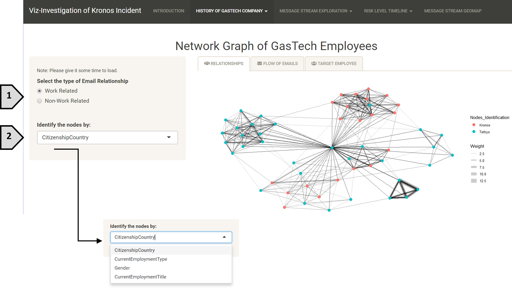
[1] Select the type of email network to visualize.

[2] Select any type of identification of the nodes from the dropdown list.

#### 2.2.2 Flow of Emails

The traffic of emails that were exchanged in the 2 weeks can be split into the date they were sent or the weekday. This is useful to identify the day where there were most emails exchanged across the GAStech company.

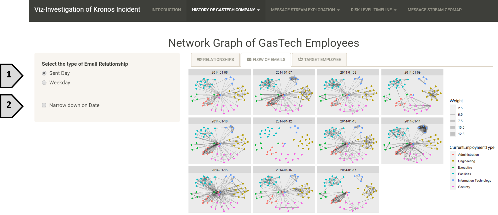
[1] Select the distribution of emails across the 2 weeks

[2] Select the checkbox to zoom in the emails exchanged on a specific date

Upon selecting the checkbox,

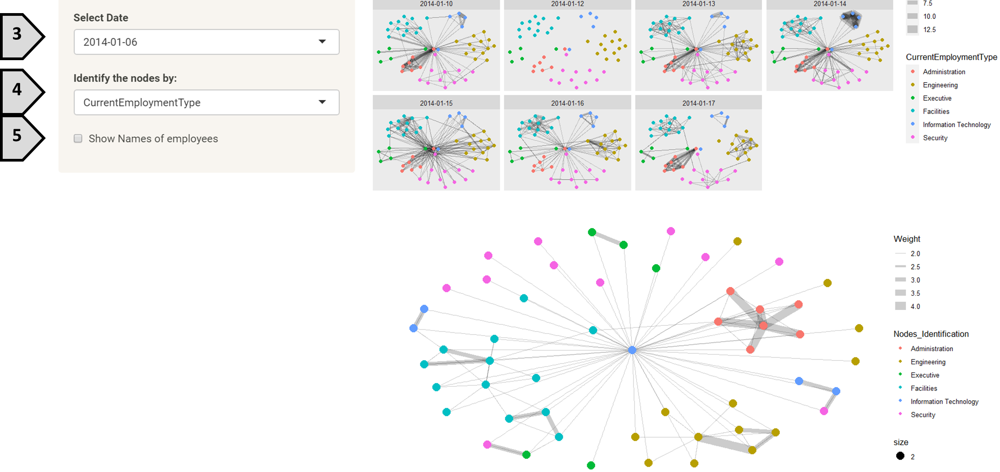

[3] Select any one date from the dropdown list

[4] Select the mode of identifying the nodes(employees)

[5] Check the checkbox to display the names of the employees represented by the nodes

#### 2.2.3 Target Employee

This tab focuses not on the whole company but rather on a single employee. It provides insights on the close associates to an employee and how frequently does the employee associates to other employees.

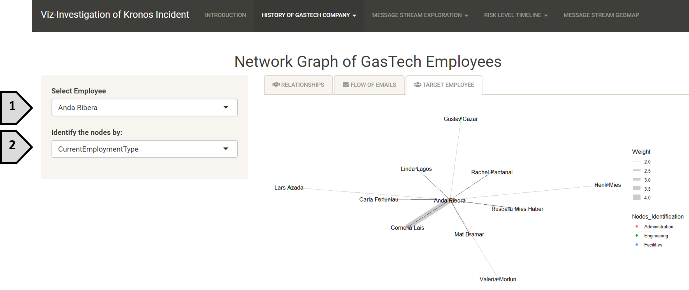

[1] Select the employee from the dropdown list of all employees in GAStech company.

[2] Select the identification of the nodes.

### 3	On the Day of Incident

This sub section of the application is to investigate the events that unfolded in Abila on 23 January 2014, by doing analysis on the message stream of microblog records and call centre reports for this period of 1700H to 2135H.

### 3.1	Message Stream Exploration

The first part is to look at some basic exploration of the message stream and its content, and in particular to distinguish and extract meaningful event information from typical chatter.

#### 3.1.1 Author Spam

This tab looks at the number of messages that different microblog authors produce. By focusing on the top few, we can see if some authors are producing spam that will interfere with the downstream sense-making of the data.

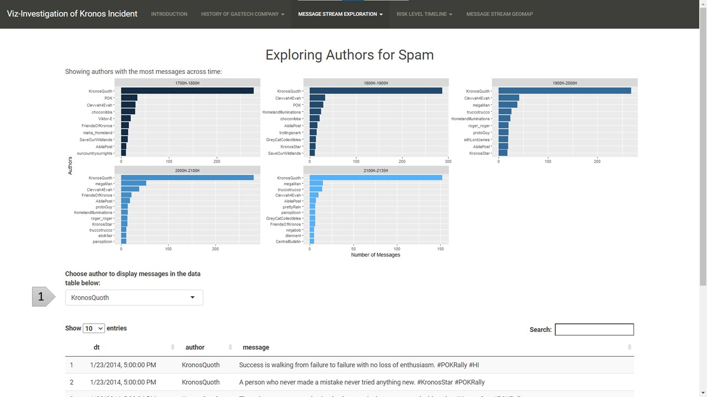

The graph on top shows the authors and their messages over time, grouped by each hour.

[1] Based on the graph, select any author to explore the content of their messages.

#### 3.1.2 Word Cloud

We make use of simple wordclouds to get an overview of the kind of topics and keywords that are most often discussed in the message stream.

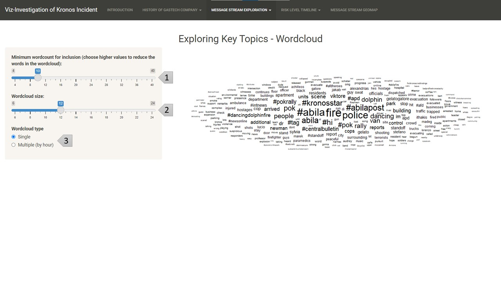

[1] Select the minimum wordcount / term frequency for a word to be included in the the wordcloud. If we want less words in the wordcloud, choose a higher value; if we want more words, choose a lower value.

[2] Select the size of the wordcloud.

[3] Select the wordcloud type. The default one uses a single wordcloud for the whole period. We can also choose the multiple wordcloud, which provides one wordcloud for each hour.

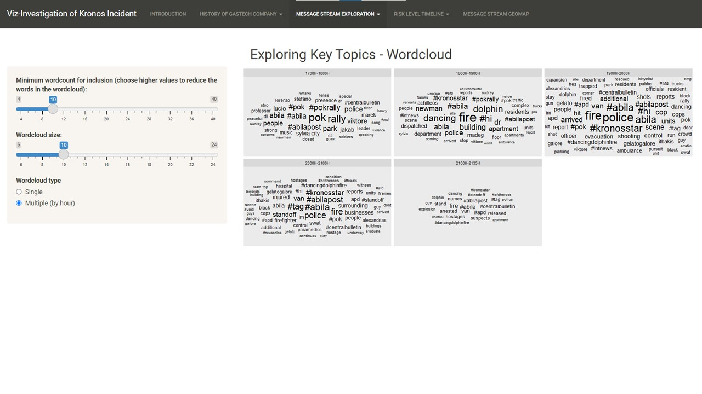

#### 3.1.3 TF-IDF Keywords

The third part utilizes the TF-IDF heuristic, which measures how important a word is to a document in a collection/corpus of documents, by including the inverse document frequency (IDF) to balance the term frequency (TF) used in the wordcloud. Therefore, it allows us to sieve out the most important events happening in each period from the chatter spread throughout the dataset.

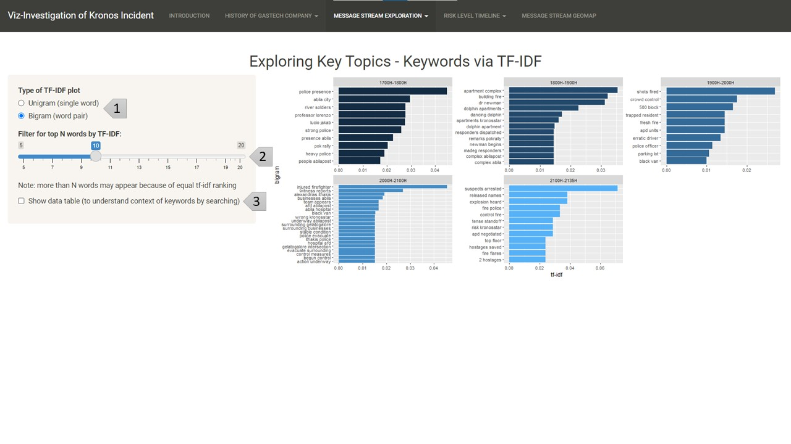

[1] Select the plot type. The default one calculates tf-idf for bigrams (word pairs), which provides more context and is thus easier to interpret for the user. The user can also choose to see the unigram (single words) tf-idf plot, as show below.

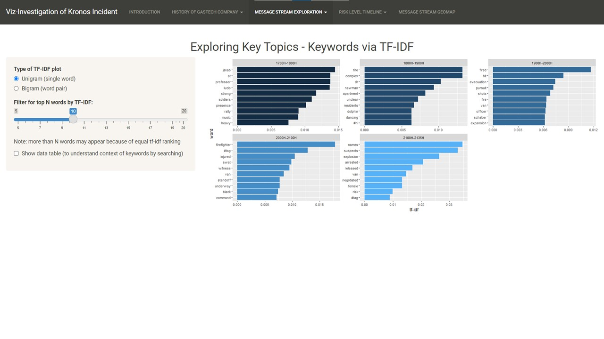

[2] Change the top N bigrams/unigrams by tf-idf value to be shown.

[3] Choose whether to show the data table of the message stream. This is useful if we need more context surrounding specific keywords, which can be done by searching for these keywords in the message stream. An example is shown below with the “alexandrias ithakis” keywords (which is a cross junction of two roads, Alexandrias and Ithakis).

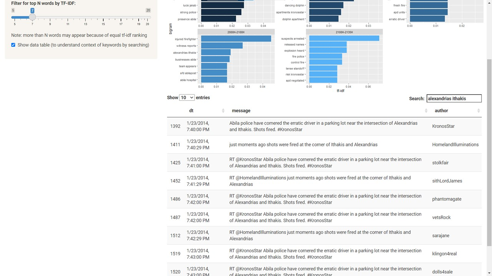

### 3.2	Risk level timeline

This section looks at how the level of the risk to the public evolves over the course of the incident unfolding, and uses various measures to explore this risk.

#### 3.2.1 By Call Centre Reports 

This tab looks at the call centre reports, which are organized, low in numbers and have a high signal-to-noise ratio (compared to microblog messages).

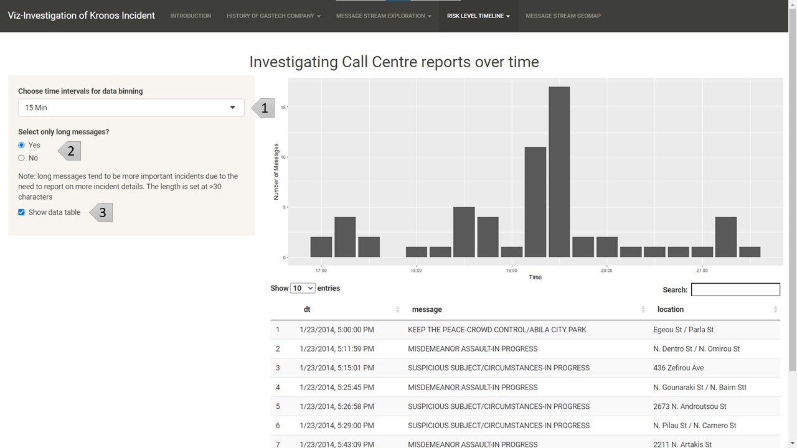

[1] Select the time intervals to bin the messages. This allows flexibility to group the messages into different desired time intervals, to explore the timeline as desired. An example is shown using 5 min intervals instead of the default 15 min interval.

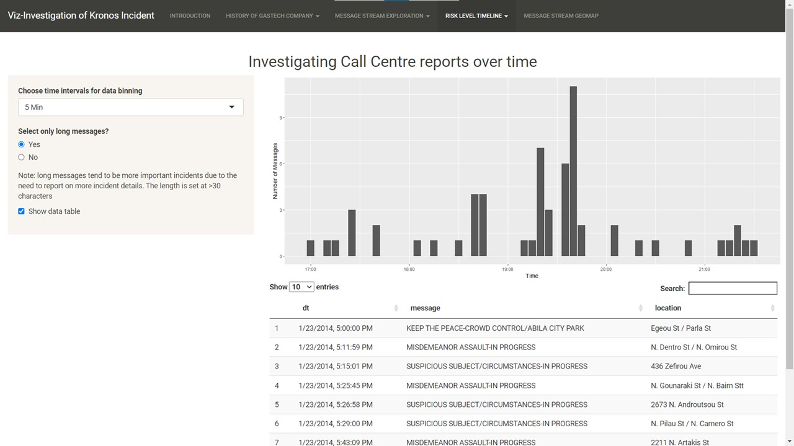

[2] Choose whether to only include call centre reports that are longer in length. This is because long messages tend to be more important incidents, due to the need to report more incident details. An example is shown below when including all messages, which tends to introduce more minor reports to the timeline.

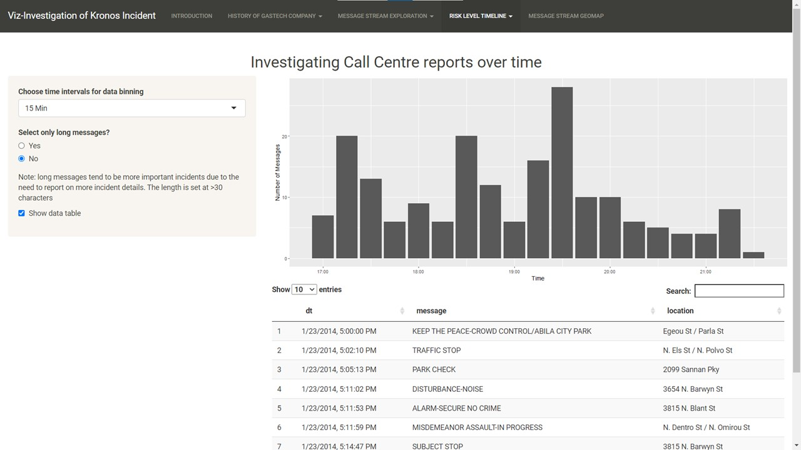

[3] Choose whether to include the data table, to see the details of the reports.

#### 3.2.2 By Microblog Messages

This tab looks at the microblog messages. While more messy and noisy, they contain significant information like crowd levels and public reactions to add to the risk level evaluation. We use various quantitative estimates to assess risk.


[1]

[2]

[3]
