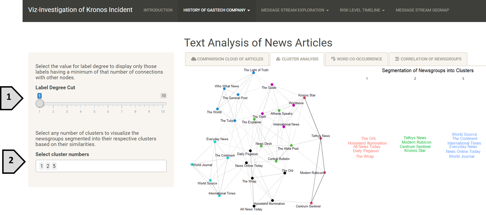

```{r setup, include=FALSE}
knitr::opts_chunk$set(echo = TRUE, warning=FALSE,message=FALSE)
```

Download User Guide [here]()

### User Guide: Viz-Investigation of Kronos Incident

### 1	Introduction Page 

On this page, there is a short description of the application and an overview of the application navigation.

<>

### 2 History of GAStech Company

This sub section of the application is to set the scene of the history that the GAStech company has had in Kronos. It provides information of the type of reputation and relations the company has had over the years with the citizens of Kronos and the protesters of “POK” in general.

### 2.1	Text Analysis

Insights on the news paper articles published from the start of establishment of the company in Kronons all the way to the year of the incident can be drawn from this section. It involves a lot of text data being visualized and cluster analysis.  

#### 2.1.1	Comparison Cloud of Articles

This is a comparison word cloud of newspaper articles that were published over the years that GAStech company has been established. The differences in the type of content written across various newspaper groups can be visualized.


[1] Select the type of data to populate the cloud. Content represents the words within the articles and title are the titles of articles.

[2] One or more number of newspaper groups can be selected from the dropdown list of all news groups available to compare the articles of those newspapers.

#### 2.1.2   Cluster Analysis

This clustering is a “TextNet” that identifies those newsgroups that are similar based on the type of words they use. The darker the edge, the more similar those newsgroups are. All the newspaper groups that we have are segregated into 6 clusters overall. 




[1] Select the number of edges a node should have to visualize only those node names.

[2] Select the cluster group number to view the newspaper groups in that cluster more clearly.


#### 2.1.3   Word Co-occurrence

This visualization is a “Text Plot” that shows the collections of word pair and how frequent these word pairs occur represented by the thickness of the edges between these words. The thicker the edge, the more frequently those words are used together.


[1] Select the cluster number to view those word that are commonly used together.

[2] Enter the number of word pars to display.

[3] Select checkbox to view “Bigram plot” for a more detailed understanding of which words comes first the which word follows.

 Upon selecting the checkbox,


[4] Enter the number of times the phrases should occur for them to appear on the plot.

#### 2.1.4 Correlation of Newsgroups

In this tab, the correlation value of the newsgroups can be identified. Previously we have seen which newsgroups are similar and how they have been clustered but, in this tab, we can visualize the correlation value between them.


[1] Select the range of correlation value.

[2] Select the checkbox to view word clouds of two different newsgroups and compare how similar or different they are.

Upon selecting the checkbox,


[3] Select the first newspaper group from the dropdown to visualize its word cloud.

[4] Select the number of words to be visualized in the first word cloud.

[5] Select the second newsgroup.

[6] Select the number of words to be visualized in the second word cloud.

### 2.2 Network Graph
Under this sub section, insights on employees working within the GAStech company can be extracted. It consists of both the official and unofficial emails sent across the company 2 weeks before the incident. The behavior of employees within these 2 weeks can provide vital information in this investigation.

#### 2.2.1 Relationships
This tab shows the network of work-related emails and non-work-related emails exchanged across all employees. The employees are represented by nodes and the thickness of edges represents the number of emails exchanged between the two nodes. The thicker the edge, the greater number of emails exchanged.


[1] Select the type of email network to visualize.

[2] Select any type of identification of the nodes from the dropdown list.

#### 2.2.2 Flow of Emails

The traffic of emails that were exchanged in the 2 weeks can be split into the date they were sent or the weekday. This is useful to identify the day where there were most emails exchanged across the GAStech company.


[1] Select the distribution of emails across the 2 weeks

[2] Select the checkbox to zoom in the emails exchanged on a specific date

Upon selecting the checkbox,


[3] Select any one date from the dropdown list

[4] Select the mode of identifying the nodes(employees)

[5] Check the checkbox to display the names of the employees represented by the nodes

#### 2.2.3 Target Employee

This tab focuses not on the whole company but rather on a single employee. It provides insights on the close associates to an employee and how frequently does the employee associates to other employees.

<>

[1] Select the employee from the dropdown list of all employees in GAStech company.

[2] Select the identification of the nodes.

### 3	On the Day of Incident


